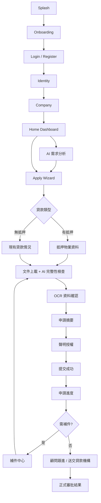
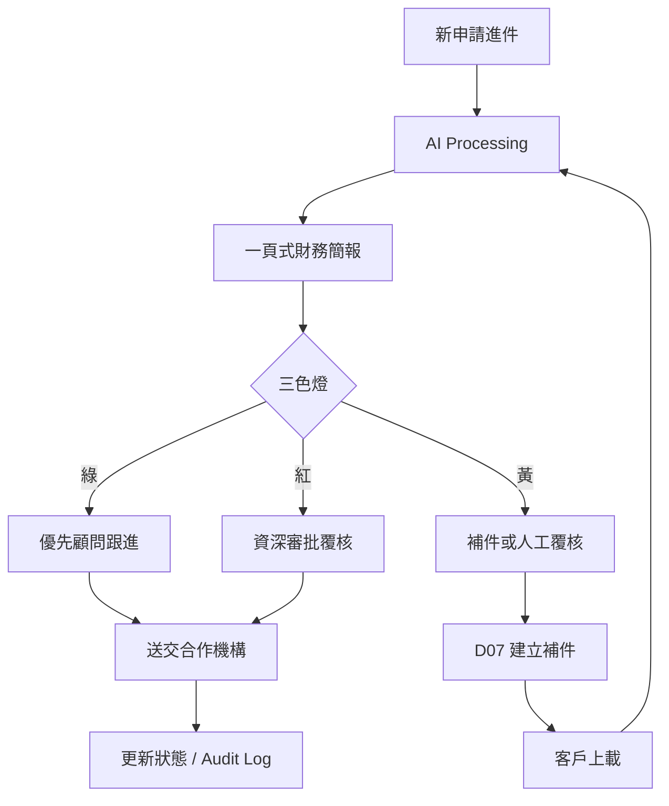

# SME LoanFlow｜User Flows

## 客戶端主流程

## 有抵押 vs 無抵押差異

| 步驟 | 有抵押 | 無抵押 |
| --- | --- | --- |
| 細節頁 | 物業資料 + 估計淨值 | 現有貸款多筆 |
| 文件 | + 物業證明、按揭資料 | + 授信信 |
| 簡報 | 顯示抵押資產區塊 | 債務比重權重更高 |

## 內部審批流程

## AI 對話例外

- 問批核機會／利率／正式條款 → 顯示「聯絡貸款顧問」
- 文件矛盾／投訴／連續兩次無法理解 → 人工轉介
- 每次回覆：直接答案 + 下一步 + 可點擊操作 + 免責

## 錯誤／例外狀態（設計要求）

| 狀態 | 行為 |
| --- | --- |
| Loading | 顯示正在處理任務文案，非純轉圈 |
| Empty | 清楚 CTA |
| Offline | 保存草稿，恢復後續傳 |
| Session Timeout | 敏感資料提醒重新登入 |
| Permission Denied | 說明相機／檔案／通知用途 |
| OCR 低信心 | 不可當確定資料，要求覆核 |
